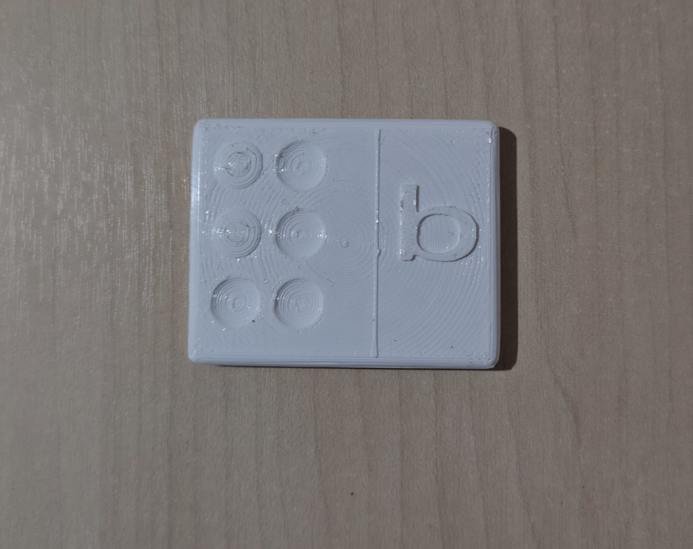
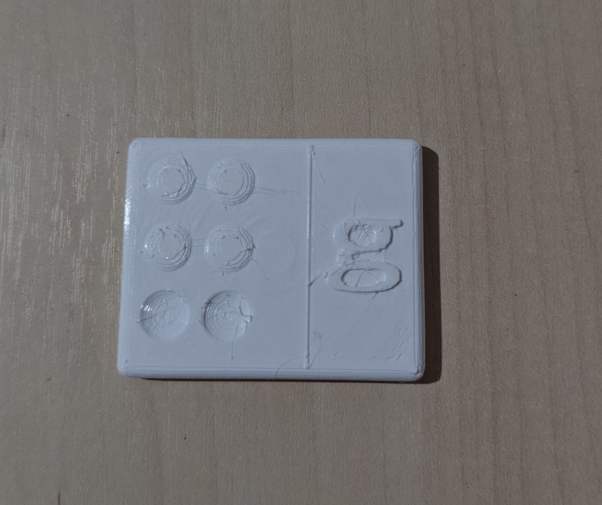
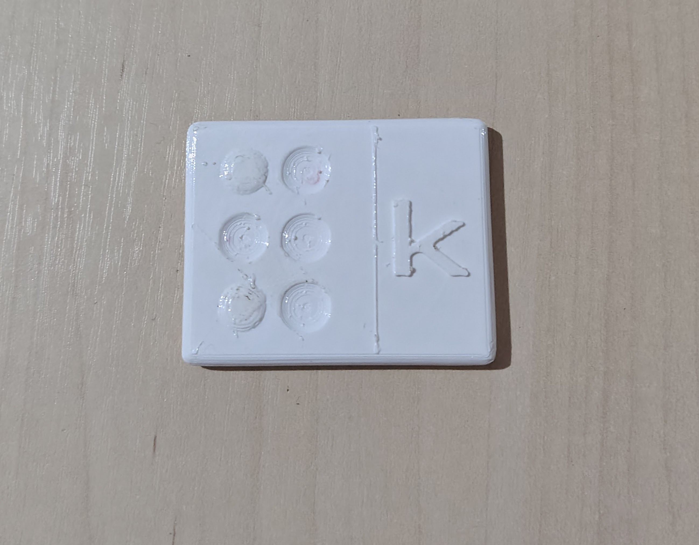

# Nome do projeto

Alfabeto em Braille

## Integrantes

- (Victor Hugo Martins Fernandes) [https://github.com/VictorHugoMF]

## Resumo

O projeto consiste na exposição inicial à grafia Braille, ensinando de maneira interativa para crianças e adolescentes, com ou sem deficiência, sobre o tema. A peça será no modelo de uma peça de dominó, mas com a grafia Braille e a sua letra associada. 

## Objetivo

O objetivo do projeto é promover a alfabetização inclusiva, permitindo que crianças e adolescentes, com ou sem deficiência visual, possam associar letras do alfabeto à sua representação em Braille de maneira iterativa e acessível. 

## Descrição do modelo 3D

A peça foi modelada em formato retangular com cantos arredondados, proporcionando maior segurança e conforto no manuseio. O objeto é dividido em duas áreas principais:
- Área Braille (lado esquerdo):
  Contém uma célula Braille composta por seis posições organizadas em duas colunas e três linhas. Cada letra terá um ou mais pontos elevados/preenchidos, representando a letra do alfabeto associada ao sistema Braille. Os demais pontos permanecem vazios para manter a lógica correta da escrita tátil. 

- Área da letra correspondente (lado direito):
  Cada letra do alfabeto estará em baixo relevo na superfície da peça. Essa representação visual complementa a leitura tátil, permitindo a associação entre o caractere do alfabeto brasileiro e a sua equivalência no sistema Braille.

A lógica do modelo foi baseada na estrututa padrão da célula Braille, onde cada letra é definida pela combinação específica de seis pontos possíveis. A utilização do formato semelhante as dominó facilita a indentificação visual e tátil, além de permitir futuras expansões do projeto com números, pontuação e sinais, formando um conjunto educativo modular.

## Arquivos do projeto

- Modelos:
- [Letra a - Grafia Braille](./modelos/letra-a-grafia-Braille.stl)
- [Letra b - Grafia Braille](./modelos/letra-b-grafia-Braille.stl)
- [Letra c - Grafia Braille](./modelos/letra-c-grafia-Braille.stl)
- [Letra d - Grafia Braille](./modelos/letra-d-grafia-Braille.stl)
- [Letra e - Grafia Braille](./modelos/letra-e-grafia-Braille.stl)
- [Letra f - Grafia Braille](./modelos/letra-f-grafia-Braille.stl)
- [Letra g - Grafia Braille](./modelos/letra-g-grafia-Braille.stl)
- [Letra h - Grafia Braille](./modelos/letra-h-grafia-Braille.stl)
- [Letra i - Grafia Braille](./modelos/letra-i-grafia-Braille.stl)
- [Letra j - Grafia Braille](./modelos/letra-j-grafia-Braille.stl)
- [Letra k - Grafia Braille](./modelos/letra-k-grafia-Braille.stl)
- [Letra l - Grafia Braille](./modelos/letra-l-grafia-Braille.stl)
- [Letra m - Grafia Braille](./modelos/letra-m-grafia-Braille.stl)
- [Letra n - Grafia Braille](./modelos/letra-n-grafia-Braille.stl)
- [Letra o - Grafia Braille](./modelos/letra-o-grafia-Braille.stl)
- [Letra p - Grafia Braille](./modelos/letra-p-grafia-Braille.stl)
- [Letra q - Grafia Braille](./modelos/letra-q-grafia-Braille.stl)
- [Letra r - Grafia Braille](./modelos/letra-r-grafia-Braille.stl)
- [Letra s - Grafia Braille](./modelos/letra-s-grafia-Braille.stl)
- [Letra t - Grafia Braille](./modelos/letra-t-grafia-Braille.stl)
- [Letra u - Grafia Braille](./modelos/letra-u-grafia-Braille.stl)
- [Letra v - Grafia Braille](./modelos/letra-v-grafia-Braille.stl)
- [Letra w - Grafia Braille](./modelos/letra-w-grafia-Braille.stl)
- [Letra x - Grafia Braille](./modelos/letra-x-grafia-Braille.stl)
- [Letra y - Grafia Braille](./modelos/letra-y-grafia-Braille.stl)
- [Letra z - Grafia Braille](./modelos/letra-z-grafia-Braille.stl)

## Como visualizar ou imprimir

O arquivo `.stl` pode ser aberto em softwares como Orcaslicer, Cura, PrusaSlicer, Blender, FreeCAD, Creality Print, entre outros.

## Imagens

## Observações
A principal limitação identificada no projeto está relacionada ao acabamento superficial da peça impressa. Apenas a utilização do recurso ironing no software OrcaSlicer não foi suficiente para alcançar um acabamento uniforme e satisfatório. Dessa maneira, é necessário realizar um pós-processamento manual utilizando uma lixa pequena ou um maçarico de precisão para corrigir as imperfeições e melhorar a aparência final da peça. 

Além disso, é importante prestar atenção durante o processo de impressão, principalmente em possíveis quebras do filamento utilizado, visto que esse problema pode comprometer a continuidade da impressão e afetar diretamente a qualidade da peça produzida.

As melhorias futuras do projeto estão concentradas no aperfeiçoamento do acabamento das peças. O objetivo é buscar novos métodos, configurações de impressão e processos de pós-processamento que proporcionem uma superfície mais uniforme, agradável ao toque e visualmente mais refinada, mantendo a funcionalidade educativa e tátil do modelo.  

## Licença e uso

Este material foi produzido para fins educacionais no contexto do repositório `open3d-education`.
